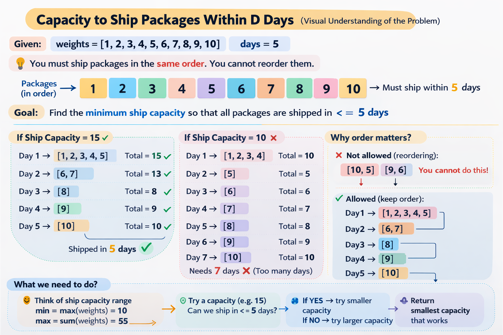

## Capacity To Ship Packages Within D Days


 
```python
class Solution:
    def shipWithinDays(self, weights: List[int], days: int) -> int:

        left = max(weights)
        right = sum(weights)

        while left <= right:

            mid = (left + right) // 2
            days_needed = 1
            current_weight = 0

            for w in weights:
                if current_weight + w > mid:
                    days_needed += 1
                    current_weight = 0
                current_weight += w

            if days_needed <= days:
                right = mid - 1
            else:
                left = mid + 1

        return left
